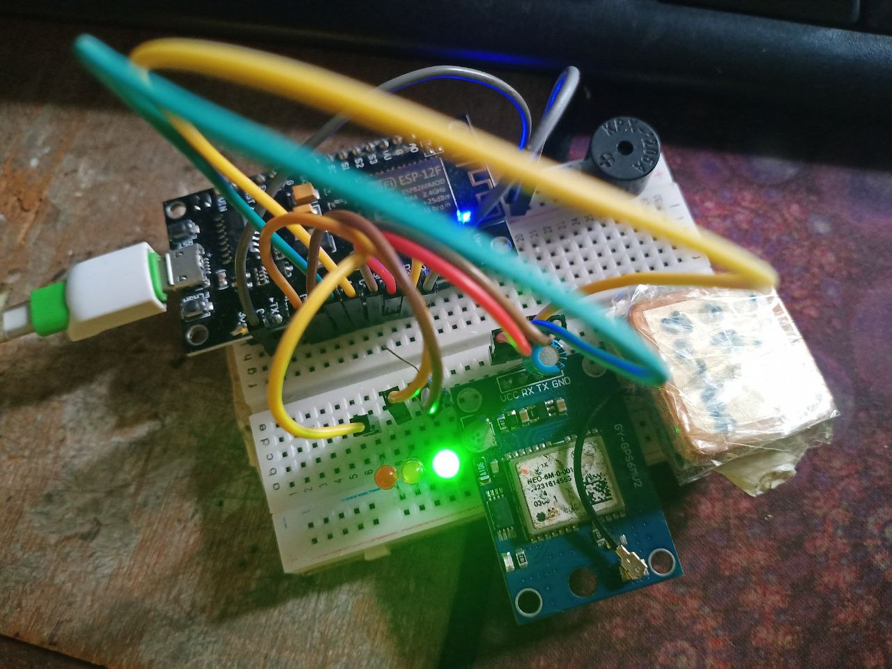
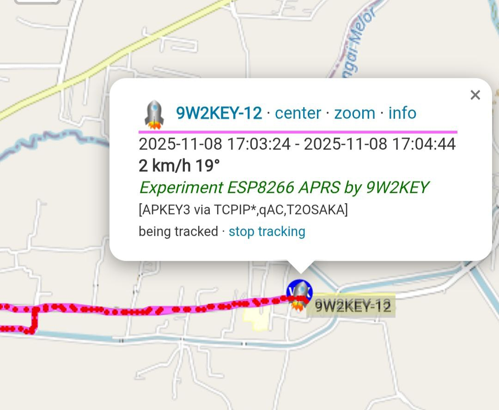

# ESP8266-APRS-9W2KEY
APRS melalui TCPIP, menggunakan ESP8266 Node MCU. Maklumat yang lebih lanjut ada di <a href="9w2key.blogspot.com">9w2key.blogspot.com</a>

Antara bahan-bahan yang diperlukan adalah:-
1. ESP8266
2. GPS Module
3. Perintang 220 Ohm
4. LED Merah
5. LED Hijau
6. LED Kuning
7. Kapasitor 0.1uF
8. Bread Board
9. Jumper wire

Cara sambung / Litar:

  Contoh selepas sambung-sambung
   
  

  Contoh yang diperolehi dari aprs.fi
   
  

<b>
  Support my project
</b>
   
  
  

